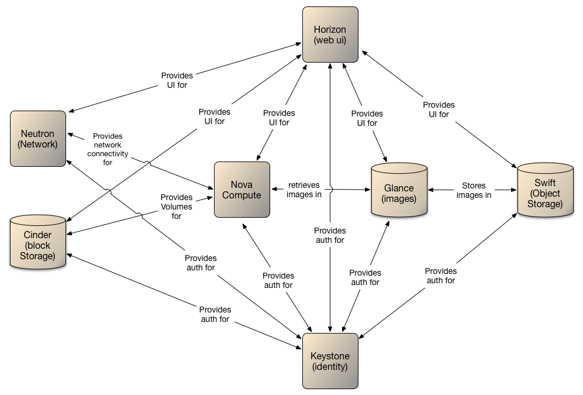

# 1.0. Introduction

---

## 1.1. Introduction
This document focuses on the technology components of the Red Hat OpenStack .  It defines the logical design to support the physical and virtual requirements, and outlines the roadmap for inclusion of future additional capabilities as they become commercially available and viable to implement.

The solution will utilise OpenStack technologies to provide the ability to deploy virtual machines and other instances to handle different tasks for managing a Cloud environment on demand. OpenStack will provide a framework for building and managing Cloud computing platforms for public and private clouds.

OpenStack falls into the category of providing Infrastructure as a Service (IaaS). It has nine key modules at its core:
-	Nova – the computing engine
-	Swift – the storage system
-	Cinder – a block storage component
-	Neutron – the networking capability
-	Horizon – the dashboard
-	Keystone – provides identity services
-	Glance – provides image services
-	Ceilometer – provides telemetry service (allowing for billing)
-	Heat – the orchestration component
Note: Each module has been further defined below.

## 1.2.	Openstack Services Overview

The technology stack consists of a series of interrelated projects that control pools of processing, storage, and networking resources which users manage through a web-based dashboard, command-line tools, or a RESTful API.

The following modules are what OpenStack consists of:

- **Nova** is the primary computing engine behind OpenStack. It is a "fabric controller," which is used for deploying and managing large numbers of virtual machines and other instances to handle computing tasks.

- **Swift** is a storage system for objects and files. Rather than the traditional idea of a referring to files by their location on a disk drive, developers can instead refer to a unique identifier referring to the file or piece of information and let OpenStack decide where to store this information. This makes scaling easy, as developers don’t have the worry about the capacity on a single system behind the software. It also allows the system, rather than the developer, to worry about how best to make sure that data is backed up in case of the failure of a machine or network connection.  Swift is designed to be accessed via an API.

- **Cinder** is a block storage component, which is more analogous to the traditional notion of a computer being able to access specific locations on a disk drive. When using block devices a larger storage device is seperated into volumes that can be mounted by the VMs as disks.

- **Neutron** provides the networking capability for the virtual machines running within the OpenStack enviroment.  Neutron can implement this through various means depending on the plugin used, including sdn, and manipulation of hardware networks via openflow.

- **Horizon**  is the dashboard behind OpenStack. It is the only graphical interface to OpenStack, so for users wanting to give OpenStack a try, this may be the first component they actually “see.” Developers can access all of the components of OpenStack individually through an application programming interface (API), but the dashboard provides system administrators a look at what is going on in the cloud, and to manage it as needed.

- **Keystone** provides identity services for OpenStack. In its simplest form it verifies against a self administered sql database, but keystone's true purpose is to take requests for authorization and provide back a token if the request is granted.  Keystone is designed to inteface with usermanagement systems such as kerberos or Active Directory.

- **Glance** provides image services to OpenStack. In this case, "images" refers to images (or virtual copies) of hard disks. Glance allows these images to be used as templates when deploying new virtual machine instances.

- **Ceilometer** provides telemetry services, which allow the cloud to provide billing services to individual users of the cloud. It also keeps a verifiable count of each user’s system usage of each of the various components of an OpenStack cloud. Think metering and usage reporting.

- **Heat** is the orchestration component of OpenStack, which allows developers to store the requirements of a cloud application in a file that defines what resources are necessary for that application. In this way, it helps to manage the infrastructure needed for a cloud service to run.


---
[Table of Contents](toc.md) | [Next - 2.0 Logical Architecture Overview](2.logical.md)
