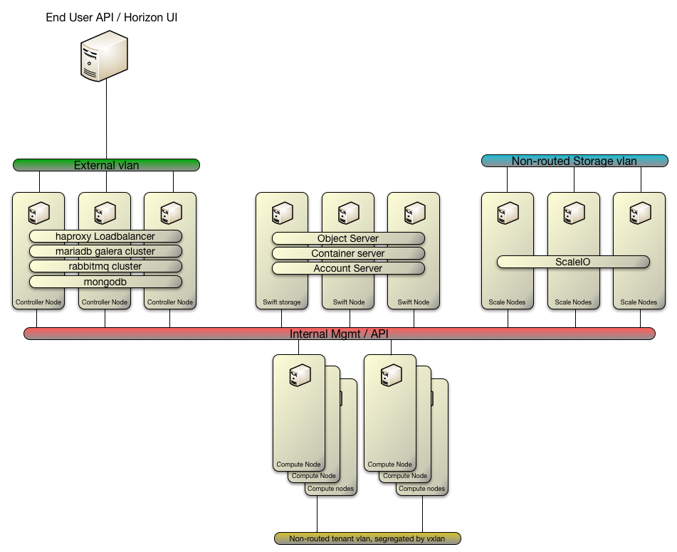

## Automation 2.0 OpenStack Architecture

### Introduction
The design for OpenStack has future production environments in mind.  The automation OpenStack Cluster is based off of [Red Hat Enterprise Linux OpenStack 6.0 (RHELOSP6)](http://www.redhat.com/en/technologies/linux-platforms/openstack-platform) which is based off the upstream Juno release. This provides for stable code, as well as support for the product.

### Hardware Considerations
The current release of "slimer / wiley" assumes the use Dell systems due to naming conventions for the network interface cards (NICs) and the controlling of their Intelligent Platform Management Interface(ipmi) which Dell uses iDrac for.

The hardware used for design and testing includes
- Dell R630
  - controllers
  - compute nodes
  - swift nodes
- Dell R730
  - scaleio

The specific model of Dell is not what is required here, rather the use of at least iDrac version 7, and the Intel(R) 10G 2P X520 Adapter.

The use of the `Intel(R) 10G 2P X520 Adapter` is necessary only as Red Hat Enterprise Linux (RHEL) 7 names the NICs according to intelligent information it gathers, such as vendor, bus, and slot number.  Changing the NIC to a different model will change the name of the NIC within the automation and cause a failure.  

_Minimum Hardware_
* 3 physical servers for control plane
* 3 physical servers for compute plane/Storage

The minimum hardware requirements are documented by Red Hat at https://access.redhat.com/documentation/en-US/Red_Hat_Enterprise_Linux_OpenStack_Platform/6/html/Deploying_OpenStack_Learning_Environments/sect-Hardware_Requirements.html. For those that do not have a Red Hat Subscription, the page can be found [here](Hardware_requirements.md).

### Conceptual Architecture

The automation model is design to allow the separation of the following functions to be assigned to the hardware.
- controller
- swift storage
- scaleio storage
- kvm compute hypervisor

### Logical Build of Cluster Items

Controller**

All openstack services are Active/Active unless otherwise specified.  The clustering of the services is handled via Pacemaker.
*The use of pacemaker limits the number of controllers in the cluster to* **16** *this is a limitation of corosync.* Also note to keep quorum, there is a minimum of **3** controllers, and that and odd number of controllers should be maintained the ability to have quorum.  For quorum the cluster must have 51% of the voting cluster machines agree on the loss of a node(s).

##### The core services provided by the controller group are:
- sql database, provided by mariadb
  - galera is used to cluster the sql database, and replication across nodes.
- mongodb database
- pacemaker / corosync
- haproxy loadbalancer
- message bus, provided by rabbitmq
  - rabbitmq operates in native clustering
- memcache

##### Openstack Services
- Neutron (networking)
  - Loadblancer as a Service (LBaaS)
  - Firewall as a Service (FWaaS)
- Glance (image service)
- Cinder (block Storage)(**active/passive**)
- Nova (non-compute)
- Horizon (web ui)
- Keystone (identity)
- Heat (orchistration) (**active/passive**)
- swift (object storage)
- ceilometer (metering)
