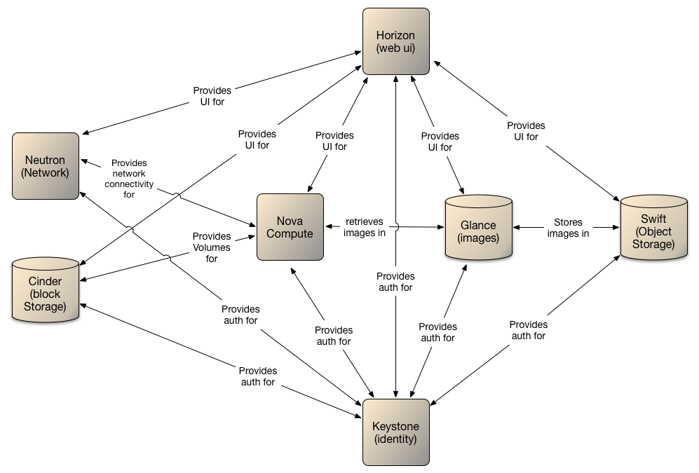
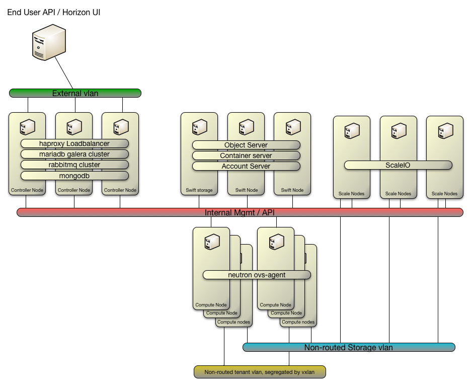
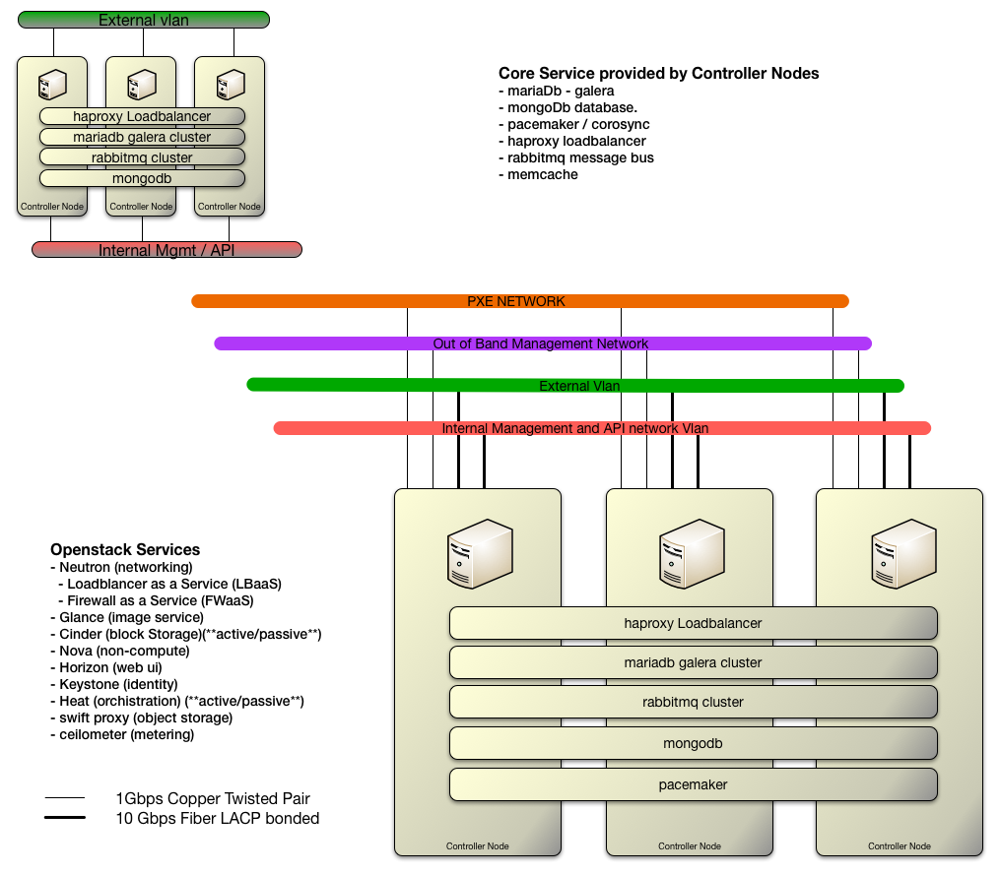
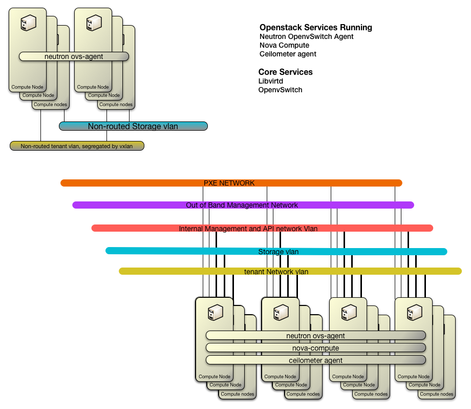

# 1.0. Introduction

---

## 1.1. Introduction
This document focuses on the technology components of the Red Hat OpenStack .  It defines the logical design to support the physical and virtual requirements, and outlines the roadmap for inclusion of future additional capabilities as they become commercially available and viable to implement.

The solution will utilise OpenStack technologies to provide the ability to deploy virtual machines and other instances to handle different tasks for managing a Cloud environment on demand. OpenStack will provide a framework for building and managing Cloud computing platforms for public and private clouds.

OpenStack falls into the category of providing Infrastructure as a Service (IaaS). It has nine key modules at its core:
-	Nova – the computing engine
-	Swift – the storage system
-	Cinder – a block storage component
-	Neutron – the networking capability
-	Horizon – the dashboard
-	Keystone – provides identity services
-	Glance – provides image services
-	Ceilometer – provides telemetry service (allowing for billing)
-	Heat – the orchestration component
Note: Each module has been further defined below.

## 1.2.	Openstack Services Overview

The technology stack consists of a series of interrelated projects that control pools of processing, storage, and networking resources which users manage through a web-based dashboard, command-line tools, or a RESTful API.

The following modules are what OpenStack consists of:

- **Nova** is the primary computing engine behind OpenStack. It is a "fabric controller," which is used for deploying and managing large numbers of virtual machines and other instances to handle computing tasks.

- **Swift** is a storage system for objects and files. Rather than the traditional idea of a referring to files by their location on a disk drive, developers can instead refer to a unique identifier referring to the file or piece of information and let OpenStack decide where to store this information. This makes scaling easy, as developers don’t have the worry about the capacity on a single system behind the software. It also allows the system, rather than the developer, to worry about how best to make sure that data is backed up in case of the failure of a machine or network connection.  Swift is designed to be accessed via an API.

- **Cinder** is a block storage component, which is more analogous to the traditional notion of a computer being able to access specific locations on a disk drive. When using block devices a larger storage device is seperated into volumes that can be mounted by the VMs as disks.

- **Neutron** provides the networking capability for the virtual machines running within the OpenStack enviroment.  Neutron can implement this through various means depending on the plugin used, including sdn, and manipulation of hardware networks via openflow.

- **Horizon**  is the dashboard behind OpenStack. It is the only graphical interface to OpenStack, so for users wanting to give OpenStack a try, this may be the first component they actually “see.” Developers can access all of the components of OpenStack individually through an application programming interface (API), but the dashboard provides system administrators a look at what is going on in the cloud, and to manage it as needed.

- **Keystone** provides identity services for OpenStack. In its simplest form it verifies against a self administered sql database, but keystone's true purpose is to take requests for authorization and provide back a token if the request is granted.  Keystone is designed to inteface with usermanagement systems such as kerberos or Active Directory.

- **Glance** provides image services to OpenStack. In this case, "images" refers to images (or virtual copies) of hard disks. Glance allows these images to be used as templates when deploying new virtual machine instances.

- **Ceilometer** provides telemetry services, which allow the cloud to provide billing services to individual users of the cloud. It also keeps a verifiable count of each user’s system usage of each of the various components of an OpenStack cloud. Think metering and usage reporting.

- **Heat** is the orchestration component of OpenStack, which allows developers to store the requirements of a cloud application in a file that defines what resources are necessary for that application. In this way, it helps to manage the infrastructure needed for a cloud service to run.


---
# 2.0. Logical Architecture Overview
---

## 2.1.	Openstack Technology Overview

The Automation 2.0 OpenStack solution will be built using OpenSource technologies and solutions to deliver cloud IaaS computing.
The Solution will consist of:
- Controllers
- Swift storage nodes
- scaleio storage nodes
- Hypervisor



_Note: The diagram also displays the non-routed networks required for vxlan transport (applicable to tenant workload only) and the ScaleIO and Swift technologies. These technologies are defined in more detail further on in the document._  

The control plane/API interconnectivity will be zoned as displayed above. Firewalls are presented on a server level for all ingress and egress.

- There is internal managment and api network that all services communicate through.
-	Client front end – Controller and swift storage nodes will communicate on this network. HA Proxy servers will proxy connections to the controller and swift nodes for access to client facing services such as horizon dashboard and swift object store access.
-	Compute - Nova compute and Neutron network nodes will be placed here. This will be where actual tenant workload is hosted. A vxlan transport network will enable client compute instance to utilise neutron network capabilities.

---

## 2.2. Infrastructure
From an infrastructure perspective, an OpenStack Cloud is built on a foundation of virtual infrastructure, where components are split between a controller and cloud consumer resources to present client applications.

In building an OpenStack Cloud the control components such as horizon dashboard will run in virtual machines.
As a best practice, the resources allocated for management functions will be separate from pure user-requested workloads, the underlying controller nodes clusters will be split into two logical groups:
-	A cluster of controller nodes running all core components and services needed to run the cloud
-	Remaining available KVM compute nodes to provide vCPU and vRAM resources for consumption.

Reasons for organizing and separating resources include:
-	Ensuring that management components are separate from the resources they are managing.
-	Minimizing overhead for cloud consumer resources. Resources allocated for cloud use have little overhead reserved.
-	Dedicating resources for the cloud. Resources can be consistently and transparently managed and carved up and scaled horizontally.

The underlying KVM Infrastructure will follow Linux KVM best practices. Design considerations specific to a OpenStack components will be addressed accordingly in this document, organized by the management nodes and cloud consumer resources.

---
## 2.3. Logical Build of Cluster Items

### Controller
The Controller nodes are responible for all of the API interactions with the services of OpenStack.  The controllers also provides databases, networking, as well as the OpenStack services.

All openstack services are Active/Active unless otherwise specified.  The clustering of the services is handled via Pacemaker.
*The use of pacemaker limits the number of controllers in the cluster to* **16** *this is a limitation of corosync.* Also note to keep quorum, there is a minimum of **3** controllers, and that and odd number of controllers should be maintained the ability to have quorum.  For quorum the cluster must have 51% of the voting cluster machines agree on the loss of a node(s).

The Contoller nodes are serviced by 4 network connections, 2x 1Gbps connections and 2x 10Gbps fiber connections.  The 2 1Gbps connections are used for out of band mangement, and PXE and configuration.  The 2x 10Gbps connection are bonded together using 802.ad.  All of the vlans that are used for the openstack services are run on this bonded network interface.




#### The core services provided by the controller group are:
- mariadb, An sql database.  The sql database handles the database needs for the openstack services.
  - Galera is used to provide redundancy to the database.  The mysql database is replicated between all controller nodes
- mongodb database. A non-sql database used to store usage data from the ceilometer service.  Mongodb handles its own replication across a replication set that is defined in setup.
- pacemaker / corosync, Pacemaker Cluster manager provides.
  - detection and recovery of machine and application-level failures
  - startup/shutdown ordering between applications
  - preferences for other applications that must/must-not run on the same machine
  - provably correct response to any failure or cluster state
- haproxy loadbalancer, HAProxy is a free, open source high availability solution, providing load balancing and proxying for TCP and HTTP-based applications by spreading requests across multiple servers.
- rabbitmq, a message bus providing Advanced Message Queuing Protocal (AMQP)
- memcached, is a general-purpose distributed memory caching system

#### Openstack Services
The services have been describe previous to this, please see section 1.2 for more info on each service.
- Neutron (networking)
  - Loadblancer as a Service (LBaaS)
  - Firewall as a Service (FWaaS)
- Glance (image service)
- Cinder (block Storage)(**active/passive**)
- Nova (non-compute)
- Horizon (web ui)
- Keystone (identity)
- Heat (orchistration) (**active/passive**)
- swift proxy (object storage)
- ceilometer (metering)

### Compute Hypervisor
The compute hypervisor node supply KVM hypervisors to the enviroment by way of libvirt.  The hypervisor node has services for ceilometer as well as neutrons openvswitch.



### Swift Storage node
While swift proxy services are run on the controllers. The rest of the swift components are proivded by the storage nodes. These additional services are:
- object server
- account server
- container server

These storage nodes maintain redundancy via rysnc.  It is suggest to have a minimum of 3 swift nodes per the OpenStack admin guide best practices.

### ScaleIO node
ScaleIO provides software-defined converged Server SAN.  ScaleIO consists of :
- Metadata Manager (MDM)
  - Configures and monitors the ScaleIO system.
  - Keeps track of storage and data mapping
  - Monitors capacity performance and Load balancing
  - Makes data migration decisions
- Gateway, Provides RESTful interface for interacting wtih the ScaleIO applicatoin
- ScaleIO Data Server (SDS), Presents local storage to be used by ScaleIO.
- ScaleIO Data Client (SDC),  Exposes the ScaleIO volumes to applications



# 3.0. Configurations
## 3.1. Configuration overview
The following list provides a high level view of the configuration defined above:
-	All client access to Horizon will be via a virtual IP that will provide access to the HA Proxy load balancers.
-	The HA Proxy service will load balance connectivity to the controller nodes that host the other OpenStack services.
-	The controller nodes will provide a centralized management system for the OpenStack deployment.
-	The Nova boot disk will be on local storage.
- A base configuration of 3 controller nodes, will provide that all openstack services are highly available.
-	MySQL databases will be clustered across at least controller nodes
-	RabbitMQ nodes running on each of the controller nodes will be clustered to provide a RabbitMQ broker service.
-	ScaleIO will be used to present underlying storage to Cinder.
-	Swift storage nodes will be used to host the glance imaging service and provide object storage functionality.






### Controller nodes

### Compute nodes

### Swift nodes

### ScaleIO nodes



---
